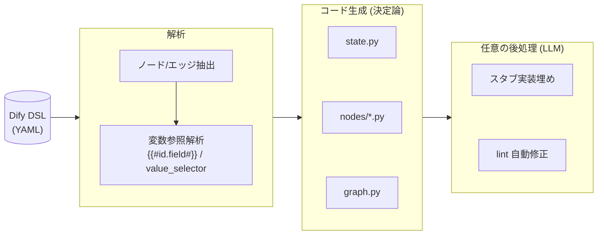

# Dify DSL to LangGraph Converter

Dify のワークフロー DSL (YAML) を解析し、実行可能で型安全な LangGraph Python パッケージを自動生成するツールです。

変換の中核は**決定論的**（同じ DSL からは常に同じコード）。LLM による補助（スタブ実装の自動埋め・lint 自動修正・ノード名の意味的リネーム）は**オプトインの後処理**です。

> **使い方は [USAGE.md](USAGE.md)（利用ガイド）を参照してください。**

## 変換パイプライン



## 特徴

- **決定論的な構造生成** — 状態（`GraphState`）・ノード登録・エッジ・分岐の配線を、同じ入力から常に同じコードとして生成します。
- **型安全** — 1 ノード = 1 キーの `TypedDict` 状態。存在しないノード参照は静的に検知できます。
- **分岐に対応** — question-classifier / if-else を `add_conditional_edges` + 生成された Router として graph.py に可視化します。
- **RAG 対応** — knowledge-retrieval は Dify の Retrieval API を、差し替え可能な `Retriever` ポートの背後で呼び出します。
- **自己完結パッケージ** — 生成物は相対 import の Python パッケージで、`python -m <pkg>` で実行できます。

## クイックスタート

```bash
# インストール（同梱の pyproject.toml を利用）
pip install .

# 変換（LLM 不要・決定論的にコードだけ生成）
dify2langgraph workflow.yml -o output/ --skip-implement

# 生成物を実行（親ディレクトリから）
cd output && python -m workflow
```

詳しい CLI オプション・RAG や LLM の設定・生成物の構造は **[USAGE.md](USAGE.md)** を参照してください。

## ライセンス

MIT License

---

## 開発者向け

- [docs/OVERVIEW.md](docs/OVERVIEW.md) — トップダウンの全体像（図解つき）
- [CONTEXT.md](CONTEXT.md) — 用語集（正準）
- [docs/adr/](docs/adr/) — 設計判断の記録（ADR）
- [docs/architecture.md](docs/architecture.md) / [docs/development.md](docs/development.md) / [docs/STYLE_GUIDE.md](docs/STYLE_GUIDE.md)
- [TODO.md](TODO.md) — ロードマップ
