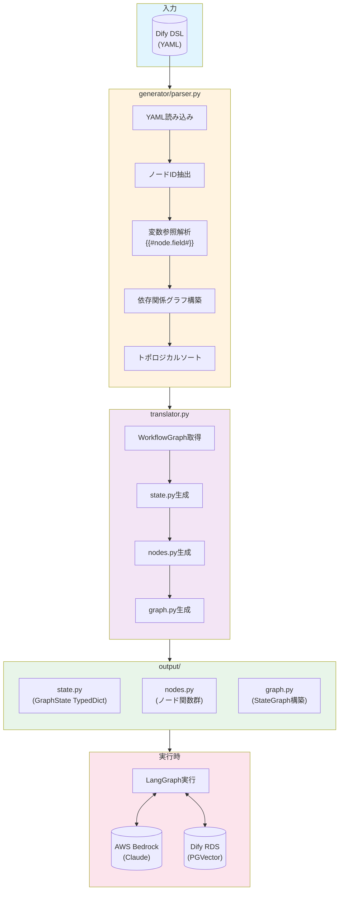
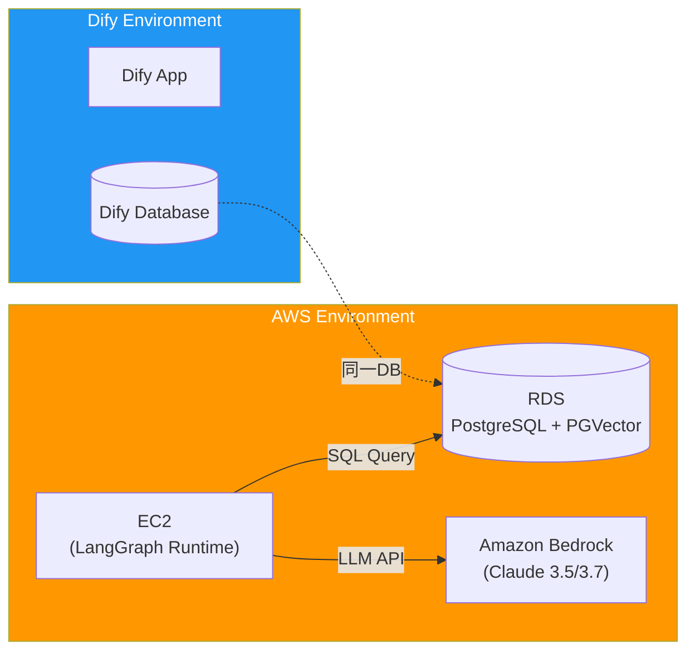
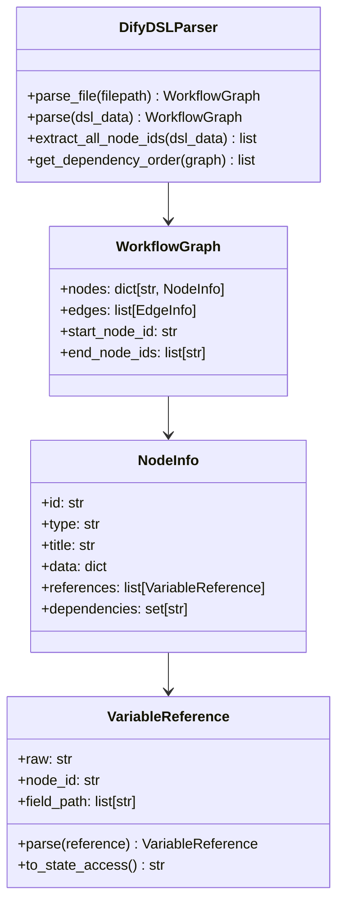
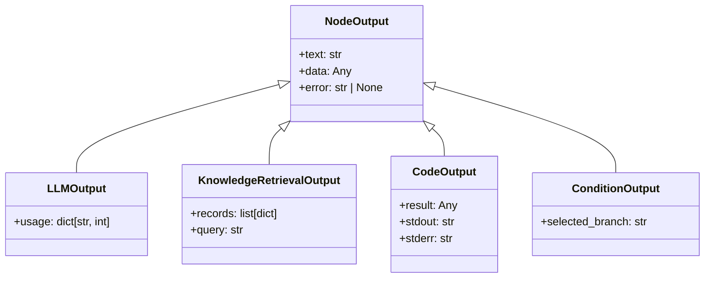

# Dify DSL to LangGraph Converter

Dify (v1.11) のワークフロー DSL (YAML) を解析し、AWS 環境で動作する LangGraph Python コードを自動生成するツールです。

## 全体ワークフロー



## システムアーキテクチャ



## 機能概要

### 1. DSL パーサー (`generator/parser.py`)

Dify の YAML DSL を解析し、以下の情報を抽出します：



#### 変数参照の変換

Dify の変数参照形式を Python のステート辞書アクセスに変換：

| Dify DSL | Python (LangGraph) |
|----------|-------------------|
| `{{#llm_node.text#}}` | `state["llm_node"]["text"]` |
| `{{#start.inputs.query#}}` | `state["start"]["inputs"]["query"]` |
| `{{#code_1.result.data#}}` | `state["code_1"]["result"]["data"]` |

### 2. コード生成 (`translator.py`)

パース結果から3つの Python ファイルを生成：

```mermaid
flowchart LR
    subgraph Generated["生成ファイル"]
        state["state.py"]
        nodes["nodes.py"]
        graph["graph.py"]
    end

    subgraph state_content["state.py の内容"]
        GS["GraphState(TypedDict)"]
        GS --> |"キー"| NK["全ノードID"]
        GS --> |"値"| NV["dict[str, Any]"]
    end

    subgraph nodes_content["nodes.py の内容"]
        NF["ノード関数群"]
        NF --> |"引数"| NS["state: GraphState"]
        NF --> |"戻り値"| NR["GraphState"]
    end

    subgraph graph_content["graph.py の内容"]
        SG["StateGraph構築"]
        SG --> AN["add_node()"]
        SG --> AE["add_edge()"]
        SG --> CE["conditional_edge()"]
    end

    state --> state_content
    nodes --> nodes_content
    graph --> graph_content
```

### 3. ランタイムサポート (`core/`)

#### base_state.py - ノード出力の型定義



#### db_retriever.py - PGVector 検索

```python
from core.db_retriever import DifyPGVectorRetriever

with DifyPGVectorRetriever() as retriever:
    results = retriever.retrieve(
        query_embedding=embedding_vector,
        dataset_id="your-dataset-id",
        top_k=5
    )
```

## インストール

```bash
# リポジトリをクローン
git clone https://github.com/o02c/dify-workflow-to-langgraph.git
cd dify-workflow-to-langgraph

# uv で依存関係をインストール
uv sync
```

## 使用方法

### 基本的な使い方

```bash
# Dify DSL を LangGraph コードに変換
uv run python translator.py workflow.yml -o output/

# 生成されたコードを確認
ls output/
# state.py  nodes.py  graph.py
```

### 生成コードの実行

```bash
cd output/
uv run python graph.py
```

## ディレクトリ構造

```
dify-workflow-to-langgraph/
├── core/                      # ランタイムサポートモジュール
│   ├── __init__.py
│   ├── base_state.py          # NodeOutput 基底クラス群
│   └── db_retriever.py        # Dify DB (PGVector) 接続
├── generator/                 # コード生成モジュール
│   ├── __init__.py
│   ├── parser.py              # YAML 解析・変数参照抽出
│   └── engine.py              # Bedrock コード生成エンジン (TODO)
├── translator.py              # メインエントリポイント
├── output/                    # 生成コード出力先
├── pyproject.toml             # プロジェクト設定
└── README.md
```

## 生成コード例

### 入力: Dify DSL (YAML)

```yaml
workflow:
  graph:
    nodes:
      - id: start
        data:
          type: start
          title: Start
      - id: llm_1
        data:
          type: llm
          title: Generate Response
          prompt: "Answer: {{#start.inputs.query#}}"
      - id: end
        data:
          type: end
          title: End
          outputs:
            - value: "{{#llm_1.text#}}"
    edges:
      - source: start
        target: llm_1
      - source: llm_1
        target: end
```

### 出力: state.py

```python
from typing import Any, TypedDict

class GraphState(TypedDict, total=False):
    """State container for all node outputs."""
    start: dict[str, Any]   # start: Start
    llm_1: dict[str, Any]   # llm: Generate Response
    end: dict[str, Any]     # end: End
```

### 出力: nodes.py

```python
from state import GraphState

def start(state: GraphState) -> GraphState:
    """Execute node: Start (type: start)."""
    return {
        **state,
        "start": {"inputs": {}},
    }

def llm_1(state: GraphState) -> GraphState:
    """Execute node: Generate Response (type: llm)."""
    # Variable references:
    #   start.inputs.query -> state["start"]["inputs"]["query"]
    query = state["start"]["inputs"]["query"]
    # TODO: Call Bedrock LLM
    return {
        **state,
        "llm_1": {"text": "generated response"},
    }

def end(state: GraphState) -> GraphState:
    """Execute node: End (type: end)."""
    # Variable references:
    #   llm_1.text -> state["llm_1"]["text"]
    return {
        **state,
        "end": {"outputs": {"value": state["llm_1"]["text"]}},
    }
```

### 出力: graph.py

```python
from langgraph.graph import END, START, StateGraph
from state import GraphState
from nodes import start, llm_1, end

def build_graph() -> StateGraph:
    graph = StateGraph(GraphState)

    # Add nodes
    graph.add_node("start", start)
    graph.add_node("llm_1", llm_1)
    graph.add_node("end", end)

    # Add edges
    graph.add_edge(START, "start")
    graph.add_edge("start", "llm_1")
    graph.add_edge("llm_1", "end")
    graph.add_edge("end", END)

    return graph.compile()

if __name__ == "__main__":
    workflow = build_graph()
    result = workflow.invoke({"start": {"inputs": {"query": "Hello!"}}})
    print(result)
```

## 環境変数

PGVector 接続用の環境変数：

| 変数名 | 説明 | デフォルト |
|--------|------|-----------|
| `DIFY_DB_HOST` | データベースホスト | `localhost` |
| `DIFY_DB_PORT` | データベースポート | `5432` |
| `DIFY_DB_NAME` | データベース名 | `dify` |
| `DIFY_DB_USER` | ユーザー名 | `postgres` |
| `DIFY_DB_PASSWORD` | パスワード | (空文字) |

## 依存関係

| パッケージ | バージョン | 用途 |
|-----------|-----------|------|
| langgraph | >=1.0.5 | ワークフローグラフ実行 |
| langchain | >=1.2.0 | LLM 抽象化レイヤー |
| langchain-aws | >=1.2.0 | Amazon Bedrock 統合 |
| psycopg2-binary | >=2.9.11 | PostgreSQL 接続 |
| pyyaml | >=6.0.3 | YAML パース |
| boto3 | >=1.42.0 | AWS SDK |

## ライセンス

MIT License
