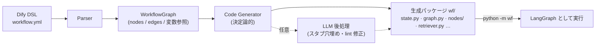
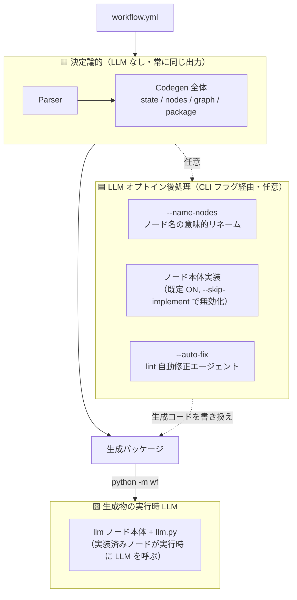
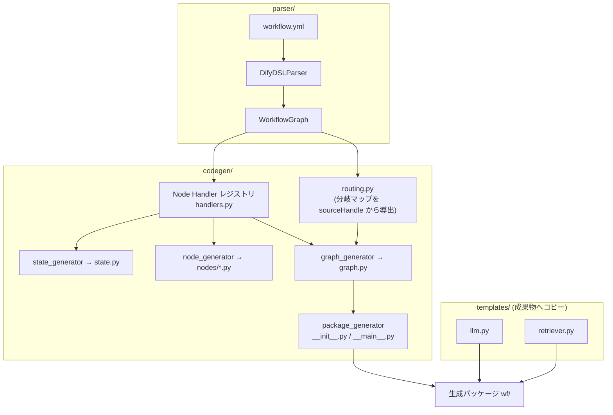
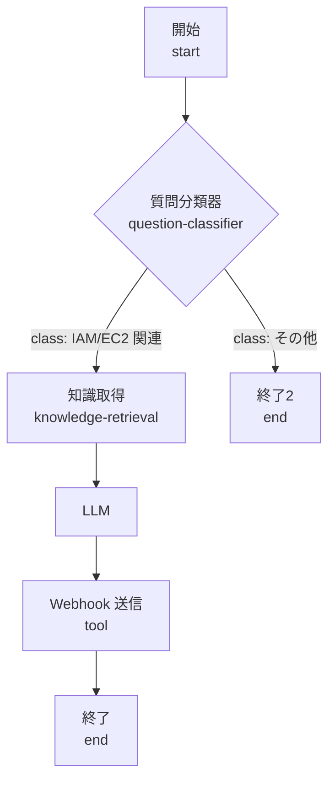
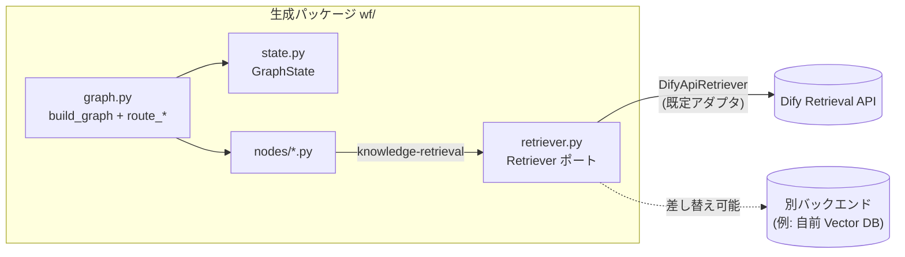

# プロジェクト全体像（トップダウン解説）

このドキュメントは「**まず最初に読む**」ための全体像です。詳細は
[requirement.md](../requirement.md) / [CONTEXT.md](../CONTEXT.md)（用語集）/
[docs/adr/](./adr/)（設計判断）/ [docs/architecture.md](./architecture.md) に委ねます。

---

## 1. これは何か

**Dify のワークフロー DSL（YAML）を、実行可能で型安全な LangGraph の Python コードに
「決定論的に」変換するトランスパイラ**です。

- 入力: Dify でエクスポートしたワークフロー定義（`workflow.yml`）
- 出力: そのまま `python -m <pkg>` で走る **自己完結した Python パッケージ**（LangGraph グラフ）

「決定論的」がキモです。同じ入力からは常に同じコードが出ます。LLM は変換の中核には使わず、
あくまで**任意の後処理**（スタブ本体の穴埋め・lint 自動修正など）に限定します（[ADR-0001](./adr/0001-deterministic-core-llm-as-opt-in-postprocessing.md)）。



---

## 2. 中心となる考え方

| 観点 | 方針 |
|------|------|
| **構造レイヤー** | ノード登録・エッジ・分岐の配線。全ノードで正しく生成することを目標（決定論的） |
| **ノード本体レイヤー** | ノード種別ごとの実装。多くは `# TODO` の **Stub**、一部は決定論的な実本体 |
| **LLM の役割** | 変換の中核には使わない。スタブ穴埋め等の**任意の後処理**のみ |
| **状態の持ち方** | `GraphState` の 1 キー = 1 ノード。キーは `node_<dify_node_id>`（[ADR-0002](./adr/0002-canonical-state-key-is-node-id.md)） |

用語（Workflow DSL / Node / Edge / 変数参照 / Structure / Node Body / Stub / GraphState /
Branching Node / Router / Node Handler / Retriever）は [CONTEXT.md](../CONTEXT.md) が正典です。

---

## 2.5 どこが決定論的で、どこが LLM か

**最重要の区別**。変換の中核は LLM を一切使いません。LLM は「オプトインの後処理」と
「生成物の実行時」にだけ登場します。



### 一覧表

| 区分 | 何を | どこ（コード） | いつ動く | LLM |
|------|------|----------------|----------|:---:|
| 🟩 **決定論コア** | DSL 解析 | `parser/dsl_parser.py` | 常に | ✗ |
| 🟩 | state / nodes / graph / package 生成、分岐 Router、変数正準化、End・知識取得の決定論本体 | `codegen/*`（`translate()`） | 常に | ✗ |
| 🟦 **LLM オプトイン（変換器）** | ノード名の意味的リネーム（日本語タイトル→snake_case） | `--name-nodes` → `generator/engine.py: generate_node_names` | フラグ指定時 | ✓ |
| 🟦 | **Stub 本体を LLM で埋める** | ノード本体実装 → `generate_all_nodes`（**既定 ON**、`--skip-implement` で無効） | 既定 / 明示無効化まで | ✓ |
| 🟦 | 生成コードの lint エラーを自動修正 | `--auto-fix` → `agents/`（coding agent） | フラグ指定時 | ✓ |
| 🟨 **実行時（生成物）** | `llm` ノードが推論を呼ぶ | 生成物の `nodes/*.py` + `llm.py` | `python -m wf` 実行時 | ✓ |

### 押さえるべき点

- **プログラマ API `translate()` は 100% 決定論的**（LLM を import すらしない）。
  テストもこの経路を使う。同じ DSL → 常に同じコード。
- **CLI の既定はノード本体を LLM で実装する**（`--skip-implement` で純決定論の Stub のみ出力）。
  つまり「決定論だけで欲しい」なら `--skip-implement` を付ける。
- Stub 本体は `# TODO` プレースホルダ。LLM オプトインはこの穴を埋める後処理であって、
  構造（state キー・エッジ・分岐配線）は決定論コアが確定済み → LLM は構造を壊せない（[ADR-0001](./adr/0001-deterministic-core-llm-as-opt-in-postprocessing.md)）。
- 例外的に **`end` と `knowledge-retrieval` は決定論的な実本体**を持つ（Stub ではない）。
  ここは LLM 不要で、変数参照転送 / Retriever 呼び出しがそのまま生成される。

---

## 3. アーキテクチャ（変換器の内部）

`src/dify2langgraph/` がトランスパイラ本体。生成される成果物とは別物なので注意。



**役割分担のポイント**:
- **Node Handler レジストリ**（`handlers.py`）が「ノード種別ごとの知識」を 1 箇所に集約
  （出力フィールド・本体・分岐情報）。ジェネレータは `get_handler()` を呼ぶだけの薄い層。
  → 新ノード種別対応 = ハンドラを 1 つ足すだけ（[ADR-0005](./adr/0005-node-type-handler-registry.md)）。
- **routing.py** は型に依存しない構造ヘルパー（どのエッジがどの分岐か）。
- **templates/** は成果物へそのままコピーされる実行時モジュール（LLM 設定・Retriever）。

### ノード種別 → ハンドラの対応（v1）

本体が「Stub」のものは決定論コアがプレースホルダを出力し、LLM オプトインで穴埋め対象になる。
「決定論的」のものは LLM 不要で実本体まで生成される（§2.5 参照）。

| 種別 | 出力 | 本体 |
|------|------|------|
| `start` | 宣言変数から導出 | 🟦 Stub（入力値） |
| `end` | 宣言 outputs | 🟩 **決定論的**（value_selector を上流参照に変換, [ADR-0004](./adr/0004-variable-reference-normalization-and-special-namespaces.md)） |
| `knowledge-retrieval` | `result: list[dict]` | 🟩 **決定論的**（Retriever ポート呼び出し, [ADR-0006](./adr/0006-retrieval-via-dify-api-behind-a-port.md)） |
| `question-classifier` / `if-else` | 分類/分岐フィールド | 🟦 Stub 本体 ＋ 🟩 **Router を graph.py に決定論生成**, [ADR-0003](./adr/0003-conditional-branching-via-generated-routers.md) |
| `llm` / `code` / `tool` / `template-transform` / `variable-aggregator` / `answer` / `agent` | 型付き | 🟦 Stub |
| その他（未登録） | `output: Any` | 🟦 汎用 Stub にフォールバック |

> 🟩 = 決定論的な実本体まで生成 / 🟦 = 決定論コアは Stub、LLM オプトインで穴埋め対象。
> なお分岐ノードは「本体は Stub だが、分岐の**配線**（Router）は決定論的」という混在。

---

## 4. 具体例で理解する（guardduty ワークフロー）

`tests/fixtures/guardduty_handler.yml`。GuardDuty の Finding を分類し、IAM/EC2 関連なら
ナレッジ検索 → LLM → Webhook 通知、それ以外なら即終了する分岐ワークフロー。

### 入力（Dify のノード構造）



### これがどう変換されるか

1. **状態** — 各ノードが `GraphState` の 1 キーになる。ノード ID `1722391426202` は
   Python 識別子にできないので、正準キー `node_1722391426202` に変換（[ADR-0002](./adr/0002-canonical-state-key-is-node-id.md)）。
   ```python
   class GraphState(TypedDict, total=False):
       node_1722391426202: Node1722391426202Output  # start
       node_1722397570856: ...Output                # question-classifier
       ...
   ```
2. **分岐** — 質問分類器は素の `add_edge` ではなく、生成された **Router 関数** +
   `add_conditional_edges` で「どちらか一方」に解決（[ADR-0003](./adr/0003-conditional-branching-via-generated-routers.md)）。
   ```python
   def route_node_1722397570856(state) -> str:
       return state["node_1722397570856"]["class_id"]
   graph.add_conditional_edges("node_1722397570856", route_node_1722397570856,
       {"1": "node_1722397470145", "1722398080959": "node_1722399356175"})
   ```
3. **ノード本体** — 種別ごとに Handler が生成。例えば知識取得ノードは Retriever を実際に呼ぶ:
   ```python
   from ..retriever import get_retriever
   ...
   "result": get_retriever().retrieve(
       query=state["node_1722391426202"]["finding"],
       dataset_ids=['a6d5e1e3-...']),
   ```
   分類器・LLM・tool などは `# TODO` の Stub（本体は後で埋める / LLM オプトインで穴埋め）。

> この変換は実際の Dify 1.16.1 に対して検証済み: 生成された知識取得ノードの呼び出し経路が
> 実サーバから実レコードを取得できることを確認済み（[ADR-0006](./adr/0006-retrieval-via-dify-api-behind-a-port.md) Status 参照）。

---

## 5. 生成物（自己完結パッケージ）の構造と実行

生成物は `sys.path` ハック無しの**相対 import パッケージ**（[ADR-0007](./adr/0007-generated-output-is-a-self-contained-package.md)）。

```
wf/                    # ← ディレクトリ名は有効な Python 識別子であること
├── __init__.py        # build_graph を再エクスポート
├── __main__.py        # `python -m wf` の実行入口
├── state.py           # GraphState と各ノード出力の TypedDict
├── graph.py           # build_graph() + route_* 関数（分岐の配線）
├── nodes/             # 1 ノード 1 ファイル（from ..state import ...）
│   ├── __init__.py
│   └── node_<id>.py
├── llm.py             # LLM 設定ヘルパー（テンプレート由来）
└── retriever.py       # Retriever ポート + DifyApiRetriever（テンプレート由来）
```



**実行**: 親ディレクトリから `python -m wf`。
**RAG の設定**: `DIFY_API_BASE_URL` / `DIFY_API_KEY` を設定すると知識取得が有効化。
未設定なら空結果を返してグラフはそのまま走る（資格情報なしでも動く）。
検索方式はノード DSL に無いため `DIFY_RETRIEVAL_SEARCH_METHOD`（既定 `semantic_search`）で制御。

---

## 6. 設計判断（ADR）マップ

各判断の「なぜ」は ADR 本体に。ここは索引。

| ADR | 決めたこと |
|-----|-----------|
| [0001](./adr/0001-deterministic-core-llm-as-opt-in-postprocessing.md) | 変換の中核は決定論的、LLM は任意の後処理 |
| [0002](./adr/0002-canonical-state-key-is-node-id.md) | `GraphState` の正準キー = `node_<dify_node_id>` |
| [0003](./adr/0003-conditional-branching-via-generated-routers.md) | 条件分岐は生成 Router + `add_conditional_edges` |
| [0004](./adr/0004-variable-reference-normalization-and-special-namespaces.md) | 変数参照を `state["node_<id>"]["field"]` に正準化。`sys`/`env` の住所も予約 |
| [0005](./adr/0005-node-type-handler-registry.md) | ノード種別ごとの知識を Handler レジストリに集約 |
| [0006](./adr/0006-retrieval-via-dify-api-behind-a-port.md) | RAG は Dify Retrieval API を差し替え可能な Retriever ポート越しに |
| [0007](./adr/0007-generated-output-is-a-self-contained-package.md) | 生成物は相対 import の自己完結パッケージ |
| [0008](./adr/0008-converter-ships-as-a-docker-image.md) | 変換ツールは Docker イメージでも配布。生成物には Dockerfile を出さない／Bedrock のリージョン既定を廃止 |

---

## 7. 実装状況（2026-08 時点）

v1 決定論コア（ADR 0002–0007）は実装＋実サーバ検証まで完了。

**できていること**
- 全ノードの構造生成（state キー・ノード登録・エッジ）
- 条件分岐 Router（question-classifier / if-else）
- Node Handler レジストリ（12 種別 + フォールバック）
- 変数参照の正準化 + End ノードの決定論的本体
- 自己完結パッケージ化（相対 import・`python -m`）
- RAG Retriever ポート（Dify API、実 1.16.1 で検証）
- 変換ツールの Docker 配布・Windows のコードページ対応（[ADR-0008](./adr/0008-converter-ships-as-a-docker-image.md)）
- [ADR-0009](adr/0009-workflow-inputs-arrive-in-the-start-nodes-state-slot.md) — ワークフロー入力は Start ノードの state スロットで受け取る

**未対応 / 保留**（[TODO.md](../TODO.md) 参照）
- **iteration（ループ）** — ループ全体が 1 ノードで内部にサブグラフを持つ表現。Handler 形状が未確定（唯一の大きなアーキ課題）
- ほとんどのノード本体は Stub（llm / code / tool / … の実装）
- `{{#context#}}` 解決、`sys.*` / `env.*` の実装
- Retriever の reranking / single モード転送
- Windows ホストでの実機検証（Windows コンテナは Windows ホスト必須のため開発環境では不可）
- LLM オプトイン後処理（スタブ穴埋め・lint 自動修正・並列化）の整理

---

## 8. さらに読む

- [requirement.md](../requirement.md) — 要件サマリ
- [CONTEXT.md](../CONTEXT.md) — 用語集（ユビキタス言語の正典）
- [docs/adr/](./adr/) — 各設計判断の理由
- [docs/tech-stack.md](./tech-stack.md) — 技術スタック（レイヤー別に何をなぜ使うか）
- [docs/architecture.md](./architecture.md) — 変換器の詳細アーキテクチャ
- [docs/development.md](./development.md) — 開発手順
- [TODO.md](../TODO.md) — ロードマップ
