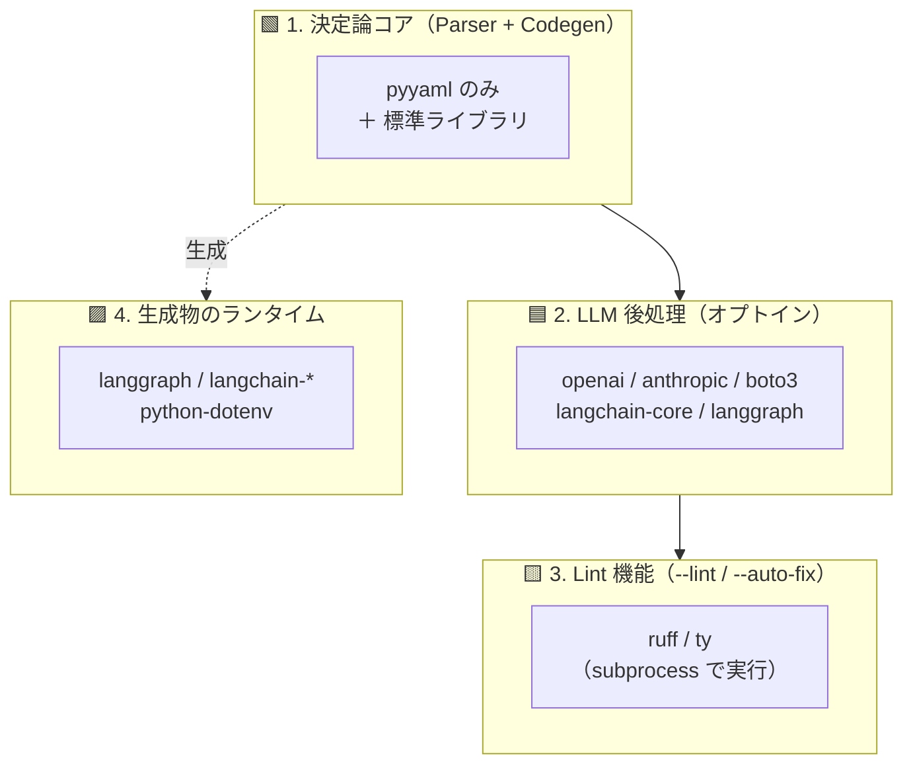

# 技術スタック

何を使っていて、**どのレイヤーが必要とするのか**を整理したものです。バージョンの正典は
`pyproject.toml`（宣言）と `uv.lock`（解決結果）で、この文書は「なぜそれが居るのか」を記します。

- [1. 全体像](#1-全体像)
- [2. レイヤー別の依存](#2-レイヤー別の依存)
- [3. 開発・配布のツール](#3-開発配布のツール)
- [4. 依存の追加・更新](#4-依存の追加更新)
- [5. 既知の歪み](#5-既知の歪み)

---

## 1. 全体像

- **言語 / ランタイム**: Python 3.13 以上（`requires-python = ">=3.13"`、`.python-version` は `3.13`）
- **ビルドバックエンド**: hatchling（`src/` レイアウト、wheel には `src/dify2langgraph` のみ）
- **依存管理**: uv（`uv.lock` をコミット。3 日検疫つき。[4 章](#4-依存の追加更新)）
- **配布形態**: ソース同梱の release archive と、同梱 Dockerfile からのローカルビルド（[ADR-0008](./adr/0008-converter-ships-as-a-docker-image.md)）

この製品には**性質の違う 4 つのレイヤー**があり、依存もそれに沿って読むのが正しい理解です。



**1 だけが変換の中核**です（[ADR-0001](./adr/0001-deterministic-core-llm-as-opt-in-postprocessing.md)）。
2〜3 は CLI フラグで入る後処理、4 は変換ツールではなく**生成物が動くときに**必要になるものです。

---

## 2. レイヤー別の依存

### 2.1 決定論コア — `parser/` `codegen/`

| パッケージ | 用途 |
|-----------|------|
| `pyyaml` | Dify DSL（YAML）の読み込み。**外部依存はこれだけ** |

ほかは標準ライブラリのみ（`json` / `pathlib` / `dataclasses` / `re` / `argparse` …）。
`--skip-implement` で走らせたときにネットワークアクセスが一切発生しないのは、この層だけで
変換が完結するためです。

### 2.2 LLM 後処理 — `llm/` `generator/` `agents/`

`--name-nodes`、ノード本体実装（既定 ON）、`--auto-fix` で使います。

| パッケージ | 用途 | 使用箇所 |
|-----------|------|---------|
| `openai` | OpenAI プロバイダ | `llm/openai.py` |
| `anthropic` | Anthropic プロバイダ | `llm/anthropic.py` |
| `boto3` | Bedrock プロバイダ（`bedrock-runtime` の `converse`） | `llm/bedrock.py` |
| `python-dotenv` | `.env` からの資格情報読み込み | `llm/openai.py`, `llm/anthropic.py` |
| `langchain-core` | `--auto-fix` のメッセージ型 | `agents/coding_graph.py`, `generator/engine.py` |
| `langgraph` | `--auto-fix` の修正ループ自体が LangGraph で組まれている | `agents/coding_graph.py` |

> プロバイダの実装は **SDK を直接叩いています**（`llm/` は LangChain を経由しません）。
> LangChain 系がここに出てくるのは `--auto-fix` のエージェント部分だけです。

### 2.3 Lint 機能 — `agents/linter.py`

| パッケージ | 用途 |
|-----------|------|
| `ruff` | 生成コードの lint（`--lint` / `--auto-fix` の 1 パス目） |
| `ty` | 型チェック（`run_ty`） |

**これらは開発ツールではなく機能の実行時依存です。** `subprocess` で実体のバイナリを呼ぶため、
入っていないと `--lint` / `--auto-fix` が `FileNotFoundError` になります。だから
`dependency-groups` の `lint` に分け、Docker イメージにもこのグループを入れています
（[ADR-0008](./adr/0008-converter-ships-as-a-docker-image.md)）。

> 生成物は `pyproject.toml` を持たないため、**ruff のデフォルト設定**（line-length 88。
> 本リポジトリの 100 ではない）で lint されます。生成器の import 整形はこれに合わせてあり、
> `TestGeneratedCodeIsLintClean` が `ruff check --isolated` で固定しています。

### 2.4 生成物のランタイム — `templates/`

`templates/*.py` は**そのまま生成物にコピーされる**ソースです（`llm.py` / `retriever.py`）。
ここでの依存は「変換ツールが必要とするもの」ではなく「**顧客が生成物を動かすときに必要なもの**」です。

| パッケージ | 用途 |
|-----------|------|
| `langgraph` | 生成された `graph.py` / ノードの `Command` |
| `langchain-core` | `BaseChatModel` 型、メッセージ型 |
| `langchain-openai` / `langchain-anthropic` / `langchain-aws` / `langchain-google-genai` | `llm.py` の `get_chat_model()` が返す chat model |
| `python-dotenv` | 生成物側の `.env` 読み込み |

`get_chat_model()` は **プロバイダごとに遅延 import** するので、実際に必要なのは選んだ 1 つだけです。
`retriever.py` は標準ライブラリの `urllib` だけで Dify Retrieval API を叩きます（[ADR-0006](./adr/0006-retrieval-via-dify-api-behind-a-port.md)）。

> これらは変換ツールの `dependencies` に入っています。`--auto-fix` が
> `templates/llm.py` の `get_chat_model()` を再利用して修正用 LLM を作るため、
> **変換ツール側からも実際に使われる**からです（`cli.py`）。

---

## 3. 開発・配布のツール

| ツール | 役割 |
|--------|------|
| **uv** 0.6.10 | 依存解決・ロック・仮想環境。Dockerfile もこれでビルド |
| **hatchling** | ビルドバックエンド（`pip install .` 用） |
| **pytest** / **pytest-cov** | テスト（`dependency-groups.test`） |
| **ruff** / **ty** | リポジトリ自身の lint・型チェック（`make lint`）。2.3 と同じ実体 |
| **Docker** | 変換ツールの実行環境ごとの配布。イメージは公開せず顧客がローカルビルド |
| **Make** | `test` / `lint` / `lock` / `docker-build` / `release` |

`dependency-groups`（PEP 735）の構成:

```toml
lint = ["ruff", "ty"]                                    # 機能の実行時依存（イメージに入る）
test = ["pytest", "pytest-cov"]                          # 開発専用（イメージに入らない）
dev  = [{include-group = "lint"}, {include-group = "test"}]
```

Docker イメージは `uv sync --frozen --no-default-groups --group lint` で、pytest を持ち込まずに
ruff / ty だけを入れています。

---

## 4. 依存の追加・更新

```bash
make lock        # 検疫日付を 3 日前に進めて再解決
```

`pyproject.toml` の `[tool.uv] exclude-newer` が**依存検疫**です。公開から 3 日未満の
バージョンは解決対象になりません（取り下げや不正リリースが気づかれる時間を確保するため）。
uv は固定時刻しか取らないので、`make lock` が `scripts/refresh-quarantine.py` で日付を
進めてからロックします。**`pyproject.toml` の日付変更は `uv.lock` と一緒にコミットしてください。**

検疫を `--exclude-newer` フラグではなくファイルに置いているのは、フラグだと後続の素の
`uv sync` が黙って cutoff を無視して lock を書き換えてしまうためです（[ADR-0008](./adr/0008-converter-ships-as-a-docker-image.md)）。

詳細は [docs/development.md](./development.md#updating-dependencies)。

---

## 5. 既知の歪み

正直に記録しておくべき点です。

- **変換ツール用と生成物用の依存が 1 つのリストに混在しています。** 2.4 の langchain provider 系は
  本来は生成物のランタイム依存ですが、`--auto-fix` が同じコードを再利用する関係で変換ツールにも
  必要です。optional extras への分離は可能ですが、顧客のインストール手順が変わるため見送っています。
- **下限バージョンが実態より緩いものがあります。** 例えば `langchain-core>=0.3.0` に対して
  lock は 1.6.3 です。`uv.lock` 経由なら問題ありませんが、lock を使わない `pip install .` では
  古い版が入りうる状態です。
- **削除済みの残骸**: `psycopg2-binary`（[ADR-0006](./adr/0006-retrieval-via-dify-api-behind-a-port.md) で
  直接 SQL の retriever を廃止した際の残り）と `langchain` メタパッケージ（どこからも import されて
  いなかった）は削除済みです。`langchain-core` など個別パッケージのみを使います。
